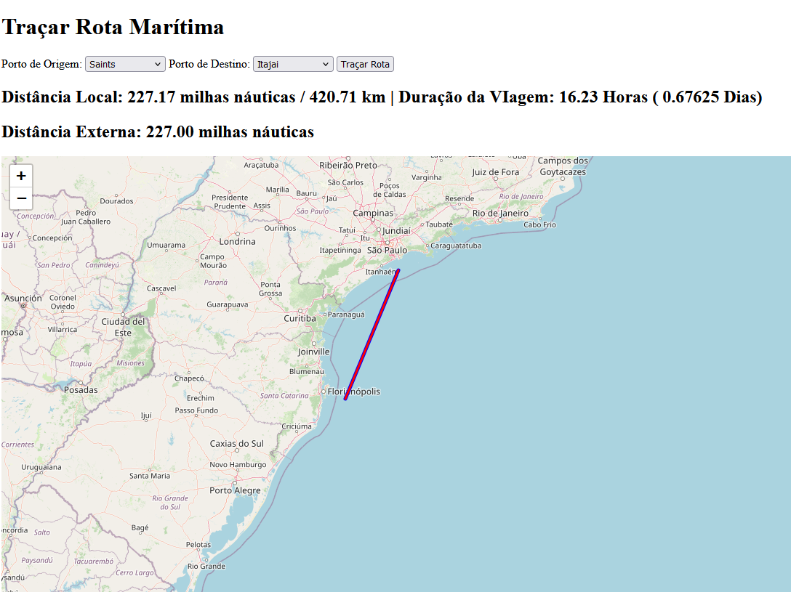
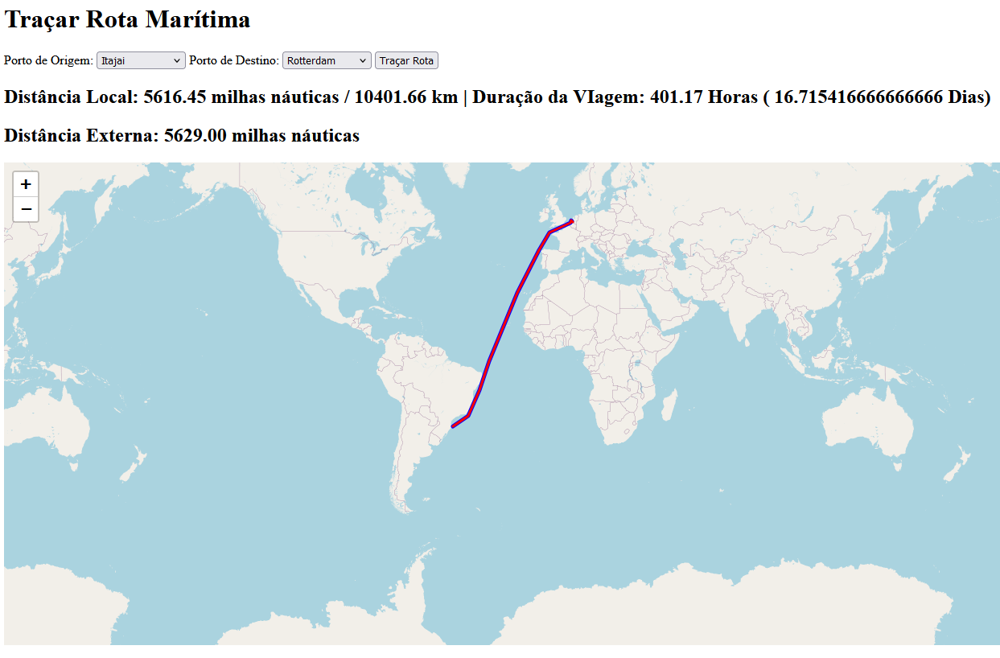

# 🚢 **Projeto de Visualização de Rotas Marítimas** 🌍

  
  
  
  

## 🛠️ **Descrição do Projeto**

Este projeto é uma aplicação web para visualização de rotas marítimas, calculando e exibindo a distância entre dois portos e desenhando trajetórias no mapa. Ele utiliza APIs para calcular e renderizar rotas com diferentes métodos de cálculo.

Como Rota 1, é utilizada a lib SeaRoute (https://pypi.org/project/searoute/)  sendo comparada com a Rota 2, com dados a partir da API da ShippingIntel (https://www.shippingintel.com/sdk)

### 🌟 **Funcionalidades**
- 🗺️ Renderização de rotas locais e externas no mapa interativo.  
- 📐 Cálculo de distâncias em milhas náuticas e quilômetros.  
- 📊 Visualização detalhada das rotas com distinção de cores (azul para SeaRoute (lib criada pelo EUROSTAT), vermelho para API ShippingIntel).  
- 🔍 Ajuste automático do zoom para se adequar à rota visualizada.  

**OBS:** Eurostat é o Escritório de estatísticas da União Europeia. Este repositório fornece recursos abertos (protótipos, provas de conceito, etc.) desenvolvidos internamente.
Github EUROSTAT: https://github.com/eurostat
Github SeaRoute: https://github.com/eurostat/searoute

---

## ⚙️ **Tecnologias Utilizadas**

### Backend
- 🐍 **Python** (Flask)
- 🗂️ APIs para cálculo de rotas

### Frontend
- 📜 **JavaScript** com **jQuery**
- 🗺️ **Leaflet.js** para mapas interativos
- 🎨 HTML5 e CSS3

---

## 🚀 **Como Rodar o Projeto**

### **Pré-requisitos**
- 🐍 Python 3.8+  
- 📦 Virtualenv ou ambiente similar  

## 📺 Telas do Projeto  

## 📚 Artigos de Referência
Confira os artigos e materiais usados como base para o desenvolvimento deste projeto.  
- [Transit Time Calculator](https://honourocean.com/port-to-port-shipping-transit-time-calculator/)
- [Sea Rates](https://www.searates.com/pt/distance-time/)
- [Artigo SObre Rotas Marítimas / Python](https://medium.com/shipping-intel/maritime-professionals-top-5-python-libraries-4e1189ca4207))
- [GitHub EuroStat / SeaRoute](https://github.com/eurostat/searoute)
- [Lib SeaRoute](https://pypi.org/project/searoute/)
- [Artigo - Uso de SeaRoute](https://medium.com/@tayljordan/ocean-voyage-appraisal-using-searoute-and-folium-2200a9402e4f)
- [ShippingIntel Doc](https://www.shippingintel.com/sdk)

